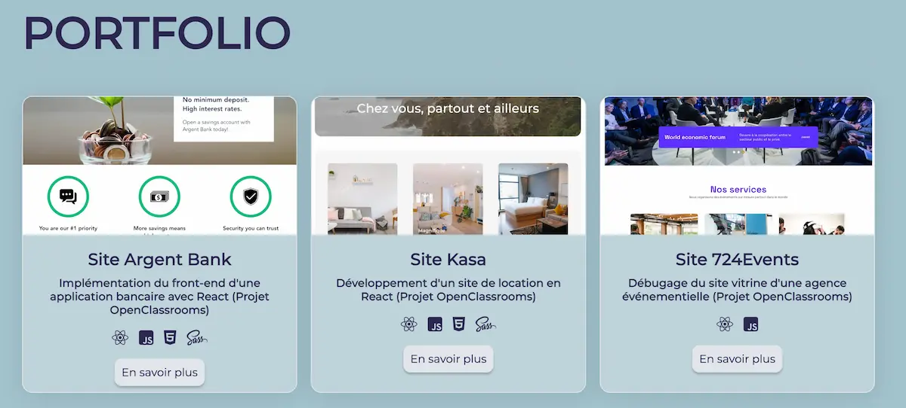

# Portfolio de Janyce DESIDERIO (PROJET 12 - OPENCLASSROOMS, parcours intégrateur web)

Bienvenue sur le dépôt de mon portfolio d'intégrateur web, un espace où je présente mes compétences, projets, et réalisations dans le domaine du développement web. 

## Aperçu

Ce portfolio a été conçu pour démontrer mes compétences en intégration web, incluant HTML, CSS / Sass, JavaScript, React, Redux et en SEO. Chaque projet reflète mon approche de résolution de problèmes et ma capacité à créer des solutions web esthétiques et fonctionnelles.

## Compétences

- HTML5 & CSS3
- JavaScript (ES6+)
- Responsive Design
- Sass
- React
- Redux
- Accessibilité Web
- Référencement

## Formation

Le portfolio est le dernier projet de la formation "Intégrateur Web" d'OpenClassrooms.

## Contact

Pour me contacter, retrouvez-moi sur Github.
